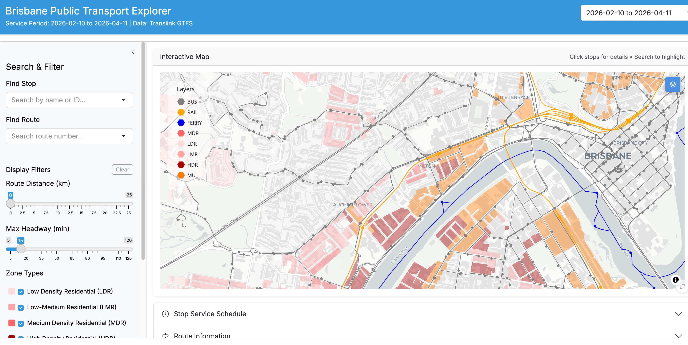
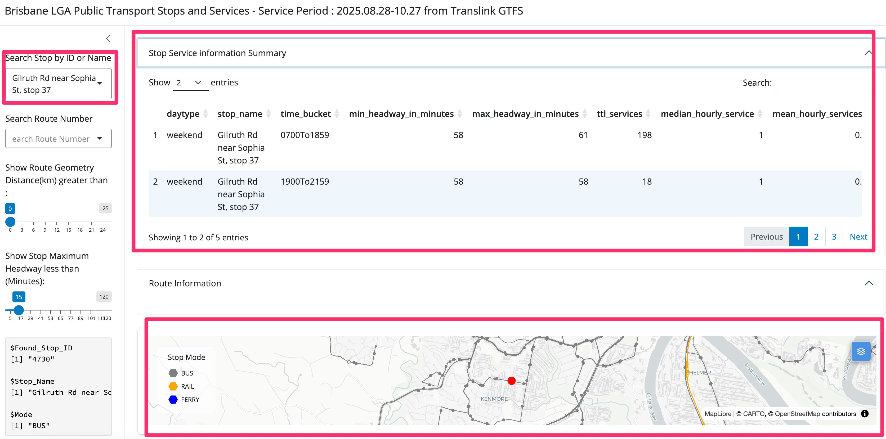
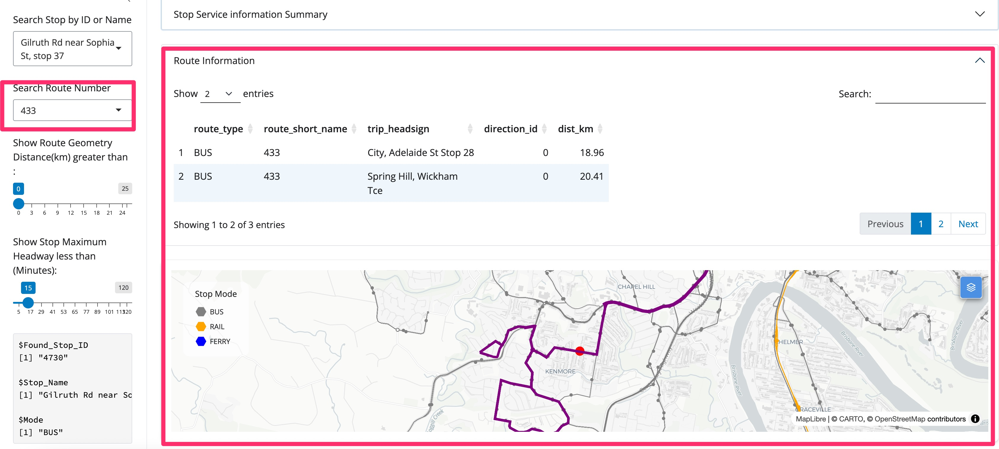
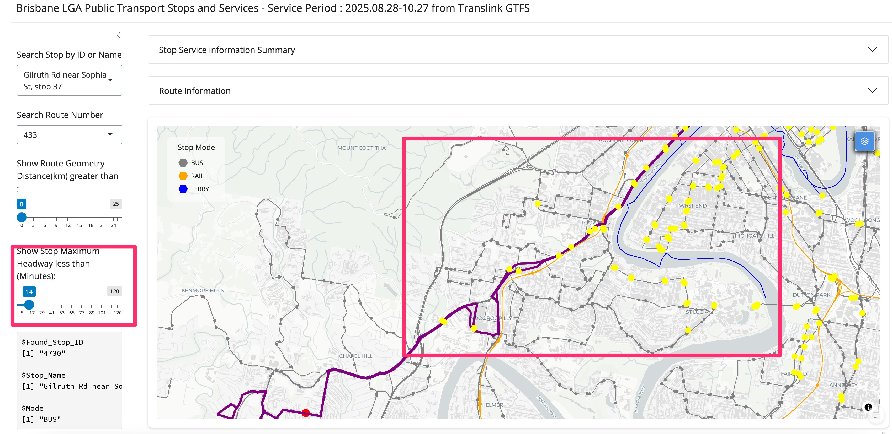

# PT_Service_explorer
This is based on the work I did at work to carry out public transport service level analysis, aggregating data to departure board style at stop level to compare and analyse.

[Dashboard click here](https://wilsonyung.shinyapps.io/BNE_PT_Service_explorer/)

# Why I did this dashboard
I would like to prove public transport service frequency and coverage is really terrible at the western suburb in Brisbane. At work I happened to be mandated the task to aggregate Brisbane City wide public transport data to highlight which stops meet High Frequency Stops definitions. After doing data extraction and wrangling process, I finally end up with stop level metrics. To better utilise the data, I decided to take some of the questions being asked in the meeting and turn this into interactive dashboard. This way, those iterative questions can be answered in no time, questions such as stops meet the maximum wait time 15 minutes/20 minutes / 30 minutes.

# Data Source
- Translink SEQ GTFS : https://www.data.qld.gov.au/dataset/general-transit-feed-specification-gtfs-translink/resource/e43b6b9f-fc2b-4630-a7c9-86dd5483552b
- Now support multi-version of GTFS
    Service Period : 
        1. 2025.08.28-10.27
        2. 2026.02.10-04.11
- Deployed on Shinyapp.io

# Data Processing and aggregation
I will place this in [another repo](https://github.com/wilsonyungsh/pt_explorer_data_preparation) - it is still work in progress

# Dashboard Features
1. Search stops by ID or name OR by click on the map, map will zoom to the stop and stop will be highlighted. In addition, Stop level service trend will appear on the "stop service information summary" pane, which is also collapsable.

2. Search Route ID, route geometry will be highlighted. Route information will appear on "route information" panel, which is also collapsable.

3. Use slider bar to filter route geometry distance or maximum wait time for next service, stops or route fit the critera will be highlighted.

4.Map Layer control for turning on and off stops/route geometry

# Other PT relevant maps and work
- [Rocket Bus 431 Kenmore-City cumulative bus patronage analysis based on Translink OD patronage data](https://wilsonyungsh.github.io/interactive/bus431_capacity.html)